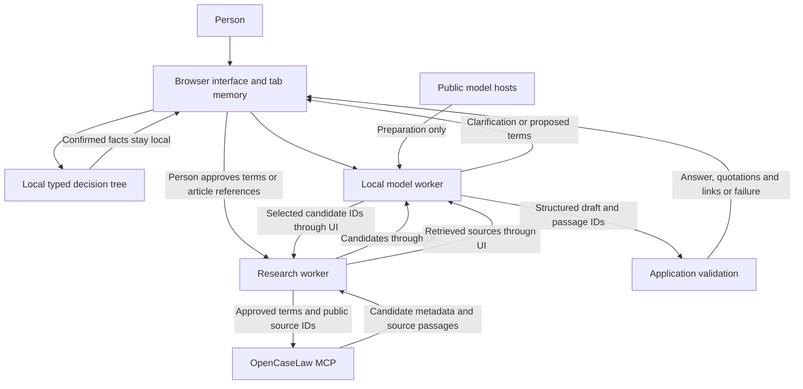

# Architecture

Swisslaw is a static React application with two browser workers: one for local inference and one for public legal research. Vite builds the application and worker bundles. No Swisslaw server receives a question or proxies a search in this implementation.

The descriptions below concern the checked-in source. A deployed copy also depends on its hosting configuration, built assets, browser and dependencies.

## Data flow



The full conversation is passed to the local model worker. The research worker receives either the approved query and selected candidate IDs, or a single allowlisted reference-recipe ID. The latter authorizes only fixed public article lookups, not private answers or a text search. It does not receive the conversation or model-generated advice.

## Main modules

| Module | Responsibility |
| --- | --- |
| `components/swisslaw-chat.tsx` | Conversation state, query/reference approval, worker orchestration, cancellation and display |
| `components/swisslaw-guide.tsx` | Local decision tree, reversible choices, focus and SVG/CSS motion |
| `lib/swisslaw-chat/guide.ts` | Typed facts, closed public recipe identifiers and bounded answer scopes |
| `lib/swisslaw-chat/prompt-budget.ts` | Reject measured prompts without sufficient output capacity |
| `lib/swisslaw-chat/engine.worker.ts` | Model preparation and local planning, candidate selection and drafting |
| `lib/swisslaw-chat/model-config.ts` | Pinned model and compiled-library URLs, integrity settings and context configuration |
| `lib/swisslaw-chat/research.worker.ts` | Narrow message interface for research and candidate selection |
| `lib/swisslaw-chat/research.ts` | Bounded MCP calls, source identity checks and passage retrieval |
| `lib/swisslaw-chat/mcp.ts` | Endpoint, protocol version and JSON/SSE response parsing |
| `lib/swisslaw-chat/policy.ts` | Structured schemas, query and URL checks, context bounds and citation resolution |
| `lib/swisslaw-chat/diagnostics.ts` | Authored error codes and messages without raw runtime error text |
| `lib/swisslaw-chat/translations.ts` and locale JSON | Interface translations |

## Local model lifecycle

The default model is `Qwen3.5-2B-q4f16_1-MLC`; `Qwen3.5-4B-q4f16_1-MLC` is an optional choice before a conversation starts. Selecting a different model does not itself start a download. The selected model loads through WebLLM 0.2.85. The source pins each model repository revision and its compiled WebGPU library revision. The configured context window is 4,096 tokens; application character bounds are supplemented by a hidden one-token local probe using identical messages and grammar. Its public usage data measures prompt tokens. A full response proceeds only if the prompt, output allocation and a96-token margin fit. The probe adds local prefill work; its token is discarded and history reset. Complete provisions are never truncated to make them fit.

Approximate initial downloads are 1.1 GB for 2B and 2.4 GB for 4B. Graphics-memory estimates are about 2.25 GB and 3.87 GB respectively; actual browser/runtime overhead varies. Choosing 4B increases resource requirements but does not establish better legal quality. The selected model stays fixed during the conversation; a model change requires starting a new conversation.

The implementation checks WebGPU capabilities before loading, including:

- WebGPU and `shader-f16`;
- `maxStorageBufferBindingSize` of at least 1,073,741,824 bytes;
- `maxComputeWorkgroupStorageSize` of at least 32,768 bytes;
- `maxStorageBuffersPerShaderStage` of at least 10.

The worker permits model-file GET requests during preparation only, using the configured model-repository prefix and exact compiled-library URL. Browser redirects used by asset hosts may involve their delivery infrastructure. Requests omit credentials and the referrer. Configured integrity checks cover the model configuration and compiled library; they are not a claim that every weight shard is independently hash-verified by application code.

All three structured-output grammar paths are prepared with fictional input, then model history is reset before private input is accepted. The worker's fetch wrapper then rejects network requests; XMLHttpRequest, WebSocket and EventSource are also disabled there. History is reset before each inference request, and the application supplies the current bounded conversation explicitly.

These are application-level controls around trusted runtime code. They are not an operating-system sandbox against a malicious dependency, browser extension, modified site or compromised device. No fallback sends the question to a remote inference service.

## Automatic public-term projection and MCP

The free-text planner runs locally. `publicLegalQuery` extracts only exact legal words from an authored dictionary, removes email/URL spans, orders and deduplicates canonical terms and caps the query at five terms. It is repeated inside the research boundary before any network request. No legal term means local clarification, not transmission of the raw question. The source request is displayed without a separate approval screen. This limits direct identifier leakage but cannot prove anonymity or correct intent. `safeQuery` additionally enforces length/character bounds. Fixed article guides bypass text search.

The research worker connects directly to:

```text
https://mcp.opencaselaw.ch/mcp
```

Transport is HTTPS POST with JSON-RPC 2.0. The configured MCP protocol is `2025-03-26`; initialization must return that version. Responses may be JSON or server-sent events. The parser accepts the matching request ID, rejects protocol/tool errors, and reads structured results. Server instructions and tool descriptions are not used as prompts or executable instructions.

The application has four fixed tools:

| Tool | Purpose |
| --- | --- |
| `search_laws` | Up to eight statute candidates for the canonical legal terms |
| `search_decisions` | Up to three judgment candidates with pinpoint references |
| `get_law` | The selected public statute article |
| `get_erwaegung` | The selected numbered judgment passage |

Search terms, public source identifiers and ordinary MCP client metadata leave the browser. There is no API key, Swisslaw search proxy, tool discovery loop or arbitrary model-chosen endpoint. Requests omit credentials and the referrer, reject redirects and request no HTTP caching. Calls have timeouts, response-size bounds of 1 MiB, and a short interval between tool calls. These controls bound this client; they do not guarantee service availability or prevent abuse by modified clients.

The local model can select up to three candidate IDs. Selection must refer to the candidates actually returned. The code then requests source text using the original public identifiers, rather than accepting a fabricated citation from the model.

## What counts as source evidence

Statutes are checked against the requested collection identifier, canton, requested language and article number. The article's heading and text are retained together. Cantonal text can remain in its original source language even when the upstream API reports the requested German language. Judgments are checked against their decision and numbered-passage identifiers.

An HTTPS source URL must match the configured public-host allowlist. That does not independently certify its contents. Source text must fit the current length bounds: at most 1,800 characters for each retrieved article or judgment passage. Overlong material is skipped, not silently truncated into evidence. Search snippets are used for selection, not as final answer evidence.

The search requests German statutory text; interface language does not change that request. Retrieved consolidation/version metadata is displayed where available. The application does not independently verify whether a version governs the user's event, check every amendment, search every source, retrieve an entire judgment or establish whether a decision remains authoritative. A failed case search can leave statute results available.

## Bounded generation and recovery

Compact EBNF grammars constrain planning, selection and answer output. Structural whitespace is not unbounded. Planning permits at most five words of up to 32 letters/hyphens each; runtime checks also reject repeated words. Answer prose and uncertainty have character bounds, citations select existing IDs and insufficient evidence has a single canonical shape. The pinned SDK’s actual grammar compiler is exercised by tests.

A failed or incomplete planner generation gets at most one local retry. GPU, context, download, timeout and cancellation failures do not trigger that retry. Partial JSON is never repaired into advice. The intake prompt treats demonstrations as independent examples, not earlier turns in the person’s conversation. Informal-language evaluation still shows semantic failures; these output constraints do not establish comprehension.

## Answer checks and their limits

The model returns JSON with an answer, proposed next steps, uncertainty and passage IDs. The application resolves IDs to retrieved text and links itself. It rejects unknown IDs, invalid schemas and invalid insufficient-source responses. Rendered quotations come from source text rather than model-invented quote strings; content is rendered as text, not source-supplied HTML.

These checks establish structural consistency and quotation provenance. They do **not** establish that a passage supports the model's conclusion, that the selected law applies, that omitted exceptions do not matter, or that a proposed action is safe. The small model can select an irrelevant but genuine passage and produce a mistaken interpretation. Its free-text uncertainty field is also model-generated.

When the model reports insufficient evidence, the UI displays an authored message and source links rather than treating that output as legal guidance. Technical failures produce controlled messages and no remote fallback. Automated tests exercise these contracts using synthetic examples and mocked source responses; they are not professional legal validation.

## State, cancellation and external recipients

Conversation state is held in JavaScript memory in the current tab. There is no application account, conversation database, document store or knowledge base. The current context allows up to ten turns and 3,000 conversation characters; an individual input is capped at 1,200 characters. Follow-ups perform fresh source retrieval using newly projected public terms rather than silently reusing an earlier source set.

Start again clears application state and terminates the inference, research and intake workers. Page-hide handling also clears the session. Stop cancels active work while retaining the displayed conversation for the user. Public model assets may remain in browser-managed caches. Clearing application state is not secure erasure of all device traces.

| Recipient or location | Data it can receive |
| --- | --- |
| Website host | Ordinary page/asset requests and connection information |
| Browser tab and local model worker | The entered conversation and retrieved sources |
| Hugging Face / model delivery infrastructure | Model downloads and connection information |
| GitHub / compiled-library delivery infrastructure | Library download and connection information |
| OpenCaseLaw | Canonical legal terms, public source identifiers, protocol metadata and connection information |
| Linked source website | A visit if the person opens a source |
| Device clipboard | The answer and source links if the person chooses to copy |

OpenCaseLaw has its own [privacy policy](https://opencaselaw.ch/datenschutz/), including search retention and potential external AI processing. Self-hosting Swisslaw does not make those external searches private or offline. The central privacy boundary is projection into public vocabulary or fixed article IDs, validated again in the research worker, together with separation of the full conversation from that worker.

## Static deployment

Build with `npm run build` and serve the resulting `dist/` over HTTPS. Preserve worker asset paths and apply the generated `dist/_headers` rules. The document cannot make external fetch requests; the research worker can connect only to the MCP endpoint; the model worker can connect to its public bootstrap hosts. The model worker then closes its own fetch capability in code after preparation. These bootstrap permissions are not a browser-enforced air gap after loading. `npm run preview` applies these policies locally; other hosts must be configured to honor them. Deployment headers and content-security rules must allow the actual worker, WebAssembly and external model/MCP connections; test them on the deployed build. Do not introduce a reverse proxy that receives full conversations or a remote inference fallback without changing the interface, documentation, threat model and tests.

A successful build establishes that assets compile. A release still needs a real-device download/inference test, network inspection of a fictional conversation, retrieval failure tests and review of any changed legal wording or translations.

## Removing downloaded model files

The model cache backend is explicitly CacheStorage. `model-cache.ts` enumerates existing `webllm/model`, `webllm/config` and `webllm/wasm` caches and deletes only request URLs under either configured pinned model revision or matching their exact compiled-library URLs. It includes partial/orphan shards and rechecks remaining entries before reporting success. It does not fetch a missing manifest or open new cache scopes. Unrelated entries remain.

The UI terminates the inference, research and intake workers before removal and guards against starting work while cleanup runs, including page-hide restoration. Another tab can later write model files again; removal is scoped to this site/profile’s application model caches, not HTTP cache, other profiles, clipboard, provider records or secure erasure. Failure is reported rather than claimed as successful deletion.


## Guided reference recipes and current scope

The first decision tree covers ordinary resignation by an employee. Confirmed private-law, indefinite employment uses OR335 with335b during probation,335c after probation, or both if probation is unknown. Fixed-term employment uses334 to explain expiry and ask about agreed early termination. Unknown term uses334/335 only for a conditional distinction, without choosing a notice period. Public/unknown employment regimes leave the private-law route. Other topics offer an unrestricted description; they are not implied to have equivalent curated coverage.

Every required guided article must return substantive complete text, the expected SR/canton/language/article and a permitted public URL. Heading-only, missing, wrong or oversized provisions reject the whole set. The generic path preserves full act titles and SR/article identity and collapses translated duplicates. Its lexical ranking and local selection still have broader relevance limitations.

Changing choices invalidates dependent choices. Reset/pagehide also remounts the guide. A free-text follow-up discards the prior recipe and uses a new automatic public-source request. No Jev API, remote classifier or new paid inference service is connected.

## Prepared practical guidance

`practical.ts` suggests common topics from local wording but never establishes legal facts. The person confirms the topic and optional facts. `practical-content.ts` supplies conditional guidance; `practical-manifest.ts` binds each route to a complete set of public provisions checked on 2026-09-20. Overtime uses OR321c and ArG9/12/13; marriage preparation uses ZGB97/98/99/100 and ZStV62. Reference text is German; all five interface languages have prepared prose. Public/self-employed/employer and non-Swiss-wedding branches do not turn ordinary private employment or Swiss marriage procedure into an unconditional personal conclusion.

`researchPractical` accepts only a fixed topic ID, retrieves each whole provision and validates SR, article, canton, language, official URL and SHA-256 of NFC/whitespace-normalized full text. A missing, changed, truncated or heading-only provision rejects the complete guide. This certifies a match to the shipped text, not current-law completeness, interpretation or applicability. Practical suggestions are separated from the collapsed legal explanation and full provisions. Prepared guides have no model dependency and no WebGPU requirement. They are visibly labelled as prepared, not model-generated.

The component invalidates active work on change, stop, clear, pagehide and unmount. It only publishes responses for the current worker and revision. All entered facts remain in page memory; no knowledge base or question telemetry is introduced. General model source-selection and substantive quality remain unresolved outside these bounded guides.

## Live intake worker

The separately pinned and verified multilingual-e5-small worker provides optional topic IDs while typing. It downloads public artifacts before accepting text, warms on synthetic input, then closes fetch. The page keeps one active and one latest pending draft and suppresses obsolete results. No research is triggered by typing or topic selection. Reset/removal also terminates this worker; removal deletes the dedicated `swisslaw/intake-v1` cache. The standalone worker CSP permits only its public bootstrap hosts and same-origin runtime assets. See [LIVE_SUGGESTIONS.md](LIVE_SUGGESTIONS.md) for the model contract, measured checks and limitations.
